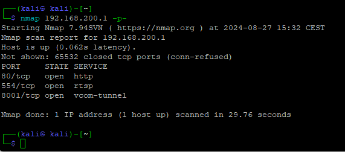
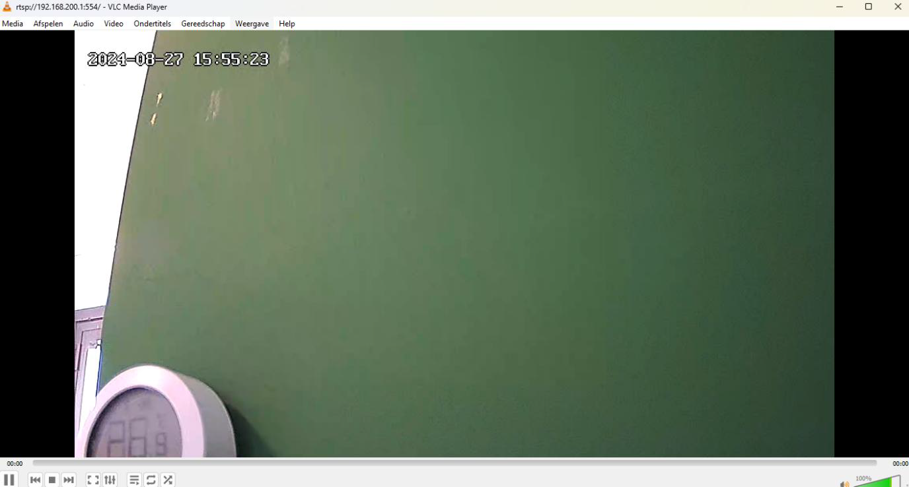

# CVE-2025-69988: Unauthenticated Open Access Point in BS Producten Petcam

## Vulnerability Metadata

| Field | Details |
| :--- | :--- |
| **Vendor** | BS Producten |
| **Product** | Petcam |
| **Affected Version** | Last tested version: 33.1.0.0818, unknown if latest update have patched this |
| **Component** | Network Configuration (Local Mode) |
| **Attack Type** | Proximity / Wireless |
| **CWE ID** | CWE-306: Missing Authentication for Critical Function |
| **CVSS 3.1 Vector** | `CVSS:3.1/AV:A/AC:L/PR:N/UI:N/S:U/C:H/I:N/A:N` |
| **Base Score** | 6.2 (Medium) |
| **Impact** | Unauthorized Access, Information Leakage |

---

## 1. Executive Summary
A missing authentication vulnerability was identified in the "Local Mode" network configuration of the BS Petcam. When active, the device broadcasts an unencrypted Wi-Fi Access Point (AP). Any attacker in physical proximity can associate with this network without a password, gaining direct access to the camera's internal network interface and private services.

---

## 2. Technical Details
The device utilizes a specific configuration for its "Local Mode" gateway functionality.

* **SSID Pattern:** `CLOUDCAM_[MAC_SUFFIX]` (e.g., `CLOUDCAM_bcfd0cb1093c`).
* **Security:** Open System (No WPA/WPA2/WPA3 encryption).
* **Authentication:** None.

Upon association, the device assigns the attacker an IP address via DHCP, placing them on the same subnet as the camera's control and streaming services.

---

## 3. Proof of Concept (PoC)

### 3.1 Network Association
1. Power on the BS Petcam and verify "Local Mode" is active.
2. Scan for wireless networks to identify the `CLOUDCAM_` SSID.
3. Connect to the network. No security key is requested.

### 3.2 Service Discovery
Once connected, an Nmap scan reveals that all internal services are exposed to the open wireless interface.

### 3.3 Data Exfiltration
The RTSP stream on port 554 and the custom API on port 8001 can be accessed immediately. The live video feed is viewable without credentials.

---

## 4. Impact
This vulnerability results in a complete loss of confidentiality and privacy. An unauthorized individual can:
* Monitor live video and audio feeds.
* Access the internal API for further exploitation (see **CVE-2024-51348**).
* Intercept unencrypted network traffic between the device and any connected clients.

---

## 5. Recommendation
* **Mandatory Encryption:** Force WPA2/WPA3 encryption for the "Local Mode" AP by default.
* **Unique Credentials:** Use a unique, per-device password printed on the device label.
* **Service Authentication:** Ensure that all internal services (RTSP, HTTP API) require individual authentication even if the network is accessed.

---

## Related Vulnerabilities
This vulnerability serves as the entry point for the **[CVE-2024-51348](./CVE-2024-51348.md)** exploit chain, providing the network adjacency required to trigger the stack-based buffer overflow on port 8001.
