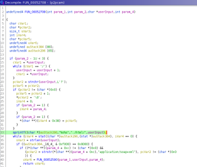
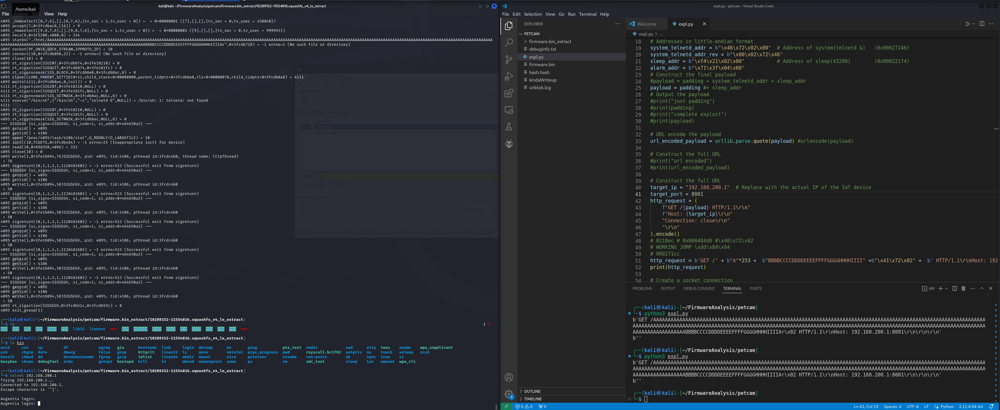

# CVE-2024-51348: Unauthenticated Remote Code Execution in BS Petcam

## Executive Summary
A critical stack-based buffer overflow vulnerability was identified in the P2P API service of BS Petcam firmware. The vulnerability exists in the handling of URI resources on port 8001. By sending a specially crafted HTTP request, an unauthenticated attacker within network range can overwrite the instruction pointer and achieve Remote Code Execution (RCE). 

Due to the device emitting an unauthenticated "local mode" wireless network by default, this vulnerability can be exploited by any attacker in physical proximity without prior credentials.

---

## Technical Background
The following analysis was performed on firmware obtained via an SPI flash dump and subsequently emulated using QEMU.

### Attack Surface
The device is configured to operate in a "local mode" where it acts as a gateway and emits an unauthenticated Wi-Fi network. Scanning the device reveals the following open ports:
* **Port 80**: Web Server
* **Port 554**: RTSP Server (Unauthenticated stream accessible via VLC)
* **Port 8001**: Custom P2P API Service (Vulnerable Target)

Analysis of the firmware revealed hardcoded credentials for the system: `root:cxlinux`.

---

## Vulnerability Analysis: Stack-based Buffer Overflow
The binary responsible for the API on port 8001 processes incoming requests by parsing the URI. 

### Root Cause
When a request is sent to `http://{IP}:8001/[resource]?mode=[arg]`, the application splits the string based on `/` and `?` delimiters. The extracted `[resource]` string is then concatenated with the string `./html/` and stored in a fixed-size stack buffer.

The application fails to validate the length of the `[resource]` input before copying it into the **260-byte buffer**. By providing a resource name exceeding this limit, the stack is corrupted.

### Exploitability & Binary Protections
An assessment of the `p2pcam` binary protections shows a complete lack of modern mitigations, significantly lowering the bar for exploitation:

---

## Proof of Concept (PoC)

### 1. Crash Verification
The following request triggers a buffer overflow and crashes the service by overwriting the return address:

`http://{IP}:8001/whitelightAAAAAAAAAAAAAAAAAAAAAAAAAAAAAAAAAAAAAAAAAAAAAAAAAAAAAAAAAAAAAAAAAAAAAAAAAAAAAAAAAAAAAAAAAAAAAAAAAAAAAAAAAAAAAAAAAAAAAAAAAAAAAAAAAAAAAAAAAAAAAAAAAAAAAAAAAAAAAAAAAAAAAAAAAAAAAAAAAAAAAAAAAAAAAAAAAAAAAAAAAAAAAAAAAAAAAAAAAAAAAAAAAAAAAAAA`

### 2. Remote Code Execution (RCE)
By calculating the offset to the return pointer, we can redirect execution to a gadget within the binary that initializes a **Telnet server**. 

In our testing, we successfully redirected execution to the Telnet initialization gadget. While the service crashes shortly after execution due to stack misalignment, the Telnet port remains open long enough for root access. 

**Note:** Persistence could be achieved by chaining a second gadget to a `sleep()` function or a loop to prevent the immediate crash, though this was not implemented during this research phase.

### Limitation: ret2libc Constraints
During exploit development, standard **ret2libc** attacks were unsuccessful. The system libraries were loaded at memory addresses starting with `0x3fXXXXXX`. 

Because the API's input handling logic splits the input string whenever it encounters a `?` character (ASCII `0x3f`), any payload containing this byte is truncated. Since all library addresses contained `0x3f`, jumping directly into `libc` was not feasible via this vector.

### The Workaround
To bypass this, we utilized a **Return-Oriented Programming (ROP)** strategy using gadgets located within the main `p2pcam` binary itself. These addresses did not contain the forbidden `0x3f` byte, allowing the full payload to be processed.

---

## Impact
This vulnerability allows for full system compromise. An attacker can:
1. Join the unauthenticated "Local Mode" network.
2. Execute arbitrary commands as the `root` user.
3. Access sensitive data, including the live camera stream and stored credentials.

## Recommendation
* Implement `strncpy()` or similar bounds-checked functions when handling URI resources.
* Enable modern binary protections during the compilation of the binary.
* Secure the "Local Mode" network with a password.
